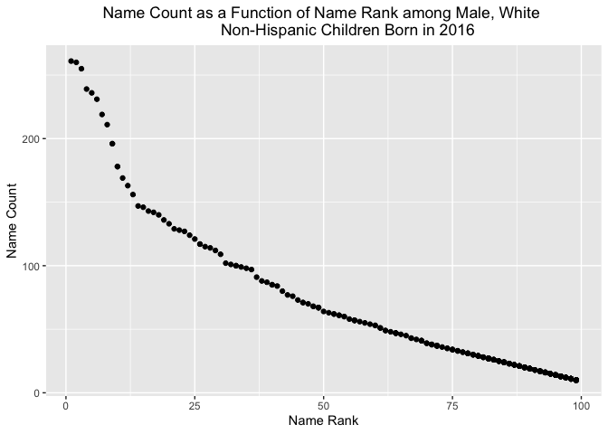

p8105\_hw2\_bpg2118
================
Benjamin Goebel
10/9/2021

#### **Problem 1**

Let’s do the following:

-   Read in the excel file for the Mr. Trash Wheel data set.
-   Clean the variables names.
-   Remove any rows that do not have a dumpster number.
-   Remove any empty columns that R reads in as “x\#”.
-   Round the number of sports balls to the nearest integer.

``` r
# Read and Clean the Mr. Trash Wheel Data
mr_trash_wheel <- 
  readxl::read_xlsx(path = here("hw2_data",
                                "Trash-Wheel-Collection-Totals-8-6-19.xlsx"),
                    sheet = "Mr. Trash Wheel") %>%
  janitor::clean_names() %>%
  filter(!is.na(dumpster)) %>%
  select(-starts_with("x")) %>%
  mutate(sports_balls = round(sports_balls, digits = 0))
```

A few points about this data set:

-   There are 344 rows (one row for each dumpster collected) in the data
    set and there are 14 columns.
-   The mean number of plastic bottles per dumpster is 1873.15.
-   The median number of glass bottles is 21.5.
-   The maximum weight of a single dumpster is 5.62 tons.
-   The minimum weight of a single dumpster is 0.96 tons.
-   The median number of sports balls in a dumpster in 2019 was 8.5.

Next, let’s do the following:

-   Read in the precipitation data for 2018 and 2019.  
-   Clean variable names.
-   Filter any row without precipitation data.

Additionally, when reading in this data, we can skip the first row, as
it does not contain column names nor actual data.

``` r
# Read and Clean the 2018 and 2019 Precipitation Data
# Skip first row, which does not contain data
eighteen_precip <- 
  readxl::read_xlsx(path = here("hw2_data",
                                "Trash-Wheel-Collection-Totals-8-6-19.xlsx"),
                    sheet = "2018 Precipitation",
                    skip = 1) %>%
  janitor::clean_names() %>%
  filter(!is.na(month), !is.na(total))
nineteen_precip <- 
  readxl::read_xlsx(path = here("hw2_data",
                                "Trash-Wheel-Collection-Totals-8-6-19.xlsx"),
                    sheet = "2019 Precipitation",
                    skip = 1) %>%
  janitor::clean_names() %>%
  filter(!is.na(month), !is.na(total))
```

Further, because precipitation is measured in inches, we can indicate
this unit in the total variable name.

``` r
eighteen_precip <- rename(eighteen_precip, total_precip_inches = total)
nineteen_precip <- rename(nineteen_precip, total_precip_inches = total)
```

Next, let’s add a year variable and make it the leftmost column for the
2018 and 2019 precipitation data frames.

``` r
# Add year variable and position as the leftmost column
eighteen_precip <- eighteen_precip %>%
  mutate(year = 2018) %>%
  relocate(year)

nineteen_precip <- nineteen_precip %>%
  mutate(year = 2019) %>%
  relocate(year)
```

Now, we can combine the precipitation data sets and convert the month
variable to a character variable.

``` r
eighteen_nineteen_precip <- bind_rows(eighteen_precip, nineteen_precip) %>%
  mutate(month = month.name[month])
```

Finally, here are some facts about the precipitation data:

-   There are 12 rows (one row for each month) and 3 columns in the 2018
    precipitation data.
-   There are 6 rows and 3 columns in the 2019 precipitation data.
    -   Notice that we are missing data for the 2019 precipitation data.
-   The total precipitation in 2018 was 70.33 inches, and the total
    precipitation in 2019, for the data we have, was 16.67 inches.
-   The month with the minimum precipitation in 2018 was January, and
    the month with the maximum precipitation in 2018 was September.
-   The month with the minimum precipitation in 2019 was June, and the
    month with the maximum precipitation in 2019 was March for the data
    we have.

#### **Problem 2**

First, let’s do the following for the pols-month data:

-   Read in the pols-month data.
-   Separate the mon variable into year, month and day variables.
-   Replace the month number with the month name.
-   Create a president variable, indicating the president’s political
    affiliation (gop or dem).
-   Remove prez\_dem, prez\_gop and the day variables.

``` r
# Read and clean the pols-month data
pols_month <- read_csv(here("hw2_data",
                            "fivethirtyeight_datasets",
                            "pols-month.csv")) %>%
  separate(mon, into = c("year", "month", "day"), sep = "-") %>%
  mutate(month = month.name[as.integer(month)],
         president = ifelse(as.logical(prez_dem), "dem", "gop")) %>%
  select(-prez_dem, -prez_gop, -day)
```

The pols-month data contains data on politicians and their respective
political affiliations at the state and federal level. The data set has
822 rows and 9 columns. It contains political data from 1947 to 2015.
There is one row observation for every month in this time frame. The key
variables indicate the number of Republicans and Democrats who are
governors, representatives and senators. The data set also has a key
variable for the political affiliation of the president. In the time
frame of this data set, there has been a Republican president for 432
months, and there has been a Democrat president for 390 months.

Second, let’s do the following for the snp data:

-   Read in the snp data.
-   Separate the date variable into year, month and day variables.
-   Replace the month number with a month name.
-   Remove the day variable.

``` r
# Read and clean the snp data. The years are two digits (YY). Used lubridate
# to create dates with 4 digit years (YYYY). I then separated the different date
# components. Subtracted the year by 100 if lubridate 
# incorrectly parsed a year as being from the 2000s if it was actually 
# from the 1900s.
snp <- read_csv(here("hw2_data",
                     "fivethirtyeight_datasets",
                     "snp.csv")) %>%
  mutate(date = lubridate::mdy(date)) %>%
  separate(date, into = c("year", "month", "day"), sep = "-") %>%
  mutate(year = as.integer(year)) %>%
  mutate(year = as.character(ifelse(year > 2021, year - 100, year)),
         month = month.name[as.integer(month)]) %>%
  select(-day)
```

The snp data contains closing price data of the S&P index over time.
There are 787 rows and 3 columns. Data is collected from 1950 to 2015.
Similar to the pols-month data, there is one row observation for every
month in this time frame. Additionally, this time span is similar to
that of the pols-month data except that data collection started three
years later for the snp data than it did for the pols-month data. The
key variable in this data set is close, which is the closing price of
the S&P index on the observed date. The median closing price of the S&P
index in the data set is $138.53.

Third, let’s do the following for the unemployment data:

-   Read in the unemployment data.
-   Pivot the month data from wide to long format (bring all the month
    columns into one column).
-   Convert the month from three character abbreviation to full month
    name.
-   Make the year column name all lowercase.
-   Convert year from a double to a character.
-   Remove any rows that do not contain an unemployment percent.

``` r
# Read and clean the unemployment data. The months are encoded as
# abbreviations. To convert to full month names, convert month abbreviations to
# month numbers. Then, convert month numbers to full month names.
unemployment <- read_csv(here("hw2_data",
                              "fivethirtyeight_datasets",
                              "unemployment.csv")) %>%
  pivot_longer(
    Jan:Dec,
    names_to = "month",
    values_to = "unemployment_pct"
  ) %>%
  mutate(month = month.name[match(month, month.abb)]) %>%
  rename(year = Year) %>%
  mutate(year = as.character(year)) %>%
  filter(!is.na(unemployment_pct))
```

The unemployment data contains unemployment percentages over time. There
are 810 rows and 3 columns. Data is collected from 1948 to 2015. Similar
to the pols-month data, there is one row observation for every month in
this time frame. Additionally, this time span is similar to that of the
pols-month data except that data collection started one year later for
the unemployment data than it did for the pols-month data. The key
variable in this data set is unemployment\_pct, which is the
unemployment percentage on the observed date. The median unemployment
percentage is 5.6%.

Fourth, let’s join the data together.

``` r
# Join the data together
pols_snp_unemployment <- 
left_join(left_join(pols_month, snp, by = c("year", "month")),
          unemployment, by = c("year", "month"))
```

This data set has 822 rows and 11 columns. When a Republican has been
president, the average S&P closing price has been $378.27 and the
average unemployment percentage has been 5.93%. When a Democrat has been
president, the average S&P closing price has been $588.26 and the
average unemployment percentage has been 5.71%.

#### **Problem 3**

First, let’s do the following to the popular baby names data:

-   Read in the popular baby names data.
-   Clean the column names.
-   Recode the ethnicity variable to account for same values that are
    coded differently.
-   Convert the childs\_first\_name variable to title case to account
    for the same names with different capitalizations.
-   Remove duplicate rows.

``` r
# Read and clean the popular baby names data
popular_baby_names <- 
  read_csv(here("hw2_data", "Popular_Baby_Names.csv")) %>%
  janitor::clean_names() %>%
  mutate(ethnicity = recode(ethnicity,
                            "ASIAN AND PACI" = "ASIAN AND PACIFIC ISLANDER",
                            "BLACK NON HISP" = "BLACK NON HISPANIC",
                            "WHITE NON HISP" = "WHITE NON HISPANIC"),
         childs_first_name = str_to_title(childs_first_name)) %>%
  distinct()
```

With our cleaned data, we can proceed. We will now produce a table to
show the popularity of the name “Olivia” over the years. Each year will
be a column and each ethnicity will be a row. For this table, all rows
have a gender value equal to “FEMALE”, so we will not include this
column. We will also not include the rank column as it is not relevant
here.

``` r
# Filter rows.
# Pivot wide year column.
# Select columns.
# Output table.
popular_baby_names %>%
  filter(childs_first_name == "Olivia") %>%
  select(year_of_birth, ethnicity, childs_first_name, count) %>%
  pivot_wider(names_from = "year_of_birth",
              values_from = "count") %>%
  select(childs_first_name, ethnicity, `2011`:`2016`) %>%
  knitr::kable(caption = "Popularity of the name Olivia from 2011 to 2016 
                          stratified by ethnicity.")
```

| childs\_first\_name | ethnicity                  | 2011 | 2012 | 2013 | 2014 | 2015 | 2016 |
|:--------------------|:---------------------------|-----:|-----:|-----:|-----:|-----:|-----:|
| Olivia              | ASIAN AND PACIFIC ISLANDER |   89 |  132 |  109 |  141 |  188 |  172 |
| Olivia              | BLACK NON HISPANIC         |   52 |   58 |   64 |   52 |   82 |   49 |
| Olivia              | HISPANIC                   |   86 |   77 |   87 |   96 |   94 |  108 |
| Olivia              | WHITE NON HISPANIC         |  213 |  198 |  233 |  248 |  225 |  230 |

Popularity of the name Olivia from 2011 to 2016 stratified by ethnicity.

Next, we will produce a table showing the most popular name among male
children over time. It will have the same columns as the previous table
did.

``` r
# Filter rows and columns.
# Pivot wide year column.
# Select columns.
# Output table.
popular_baby_names %>%
  filter(gender == "MALE", rank == 1) %>%
  select(year_of_birth, ethnicity, childs_first_name) %>%
  pivot_wider(names_from = "year_of_birth",
              values_from = "childs_first_name") %>%
  select(ethnicity, `2011`:`2016`) %>%
  knitr::kable(caption = "Most popular names among male children from 2011 
                          to 2016.")
```

| ethnicity                  | 2011    | 2012   | 2013   | 2014   | 2015   | 2016   |
|:---------------------------|:--------|:-------|:-------|:-------|:-------|:-------|
| ASIAN AND PACIFIC ISLANDER | Ethan   | Ryan   | Jayden | Jayden | Jayden | Ethan  |
| BLACK NON HISPANIC         | Jayden  | Jayden | Ethan  | Ethan  | Noah   | Noah   |
| HISPANIC                   | Jayden  | Jayden | Jayden | Liam   | Liam   | Liam   |
| WHITE NON HISPANIC         | Michael | Joseph | David  | Joseph | David  | Joseph |

Most popular names among male children from 2011 to 2016.

Finally, for male, white non-hispanic children born in 2016, we will
produce a scatter plot visualizing the number of children with a given
name (y axis) against the rank in popularity of that name (x axis).

``` r
# Filter to desired population.
# Create plot.
# Label axes and title.
# Center title.
popular_baby_names %>%
  filter(gender == "MALE", ethnicity == "WHITE NON HISPANIC", 
         year_of_birth == 2016) %>%
  ggplot(aes(x = rank, y = count)) +
    geom_point() +
  labs(
    title = "Name Count as a Function of Name Rank among Male, White 
             Non-Hispanic Children Born in 2016",
    y = "Name Count",
    x = "Name Rank"
  ) +
  theme(plot.title = element_text(hjust = 0.5))
```

<!-- -->
